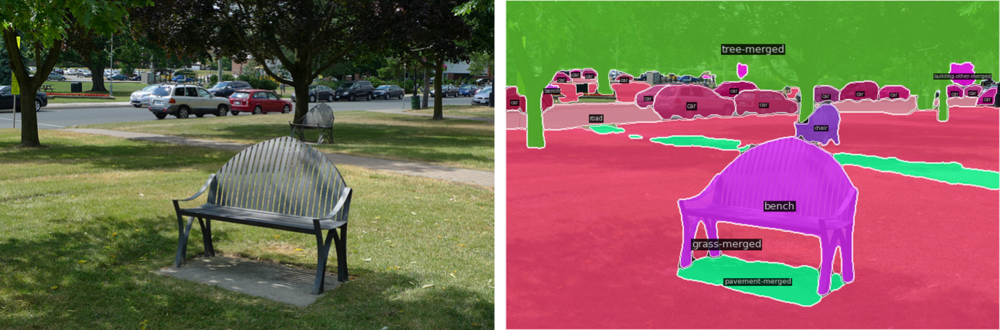
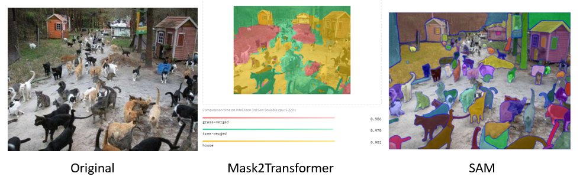
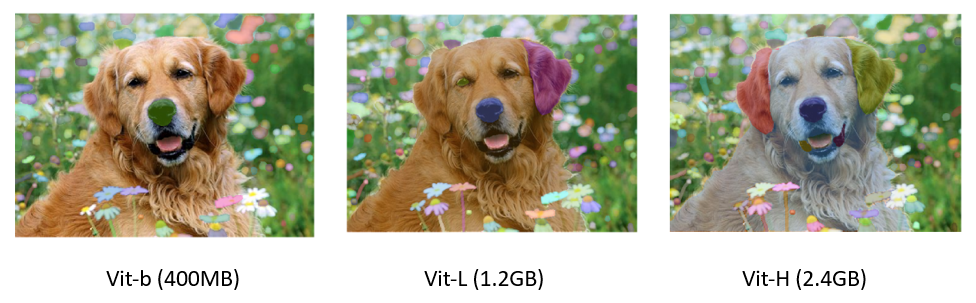

# Motivation
Labeling object names and mapping the object is time-consuming. Usually, we use OpenCV2, open resources, third-company products, or hiring people for labeling.
This project aims to auto labeling for given images with names users specifies.

  

# Mask2Former vs SAM

The below figures show the difference between Mask2Former and SAM.
- Mask2Former does not capture the individual objects, and it returns "grass", "tree", and "house".
- SAM captures each object well, but SAM does not know name of the objects.

  

# SAM Checkpoint Model Differences:
The below figures show that the differences of the model performance.
- Vit-B (400 MB) captures the small parts of objects such as nose.
- Vit-L (1.2 GB) captures larger parts of objects such as ears, but not capture the entire dog yet.
- Vit-H (2.4 GB) captures any sizes of objects including the entire dog.

We recommend to use Vit-H.

  

